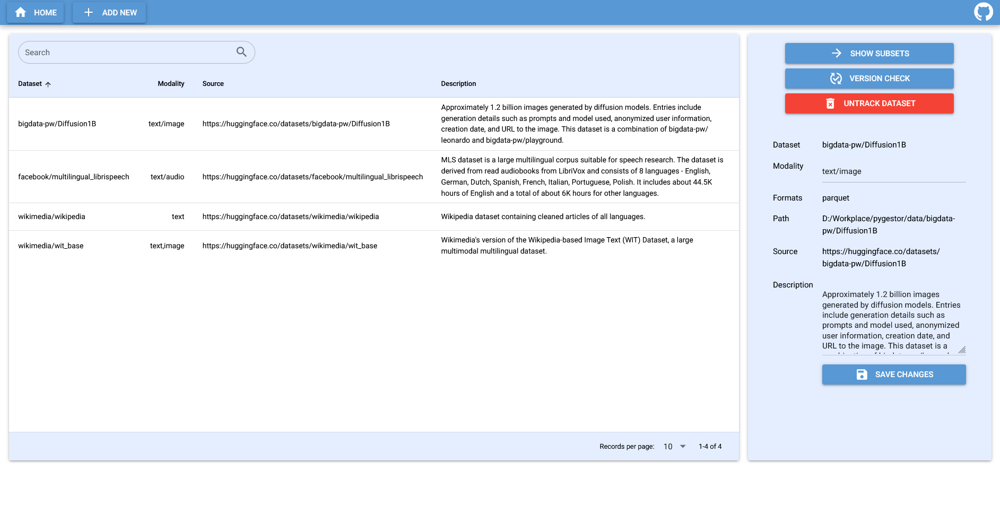

# Pygestor
[](https://github.com/rlsn/Ingestor/actions/workflows/python-app.yml)
[](https://github.com/rlsn/Pygestor/actions/workflows/python-publish.yml)


[](https://opensource.org/licenses/MIT)

A data interface designed to seamlessly acquire, organize, and manage diverse datasets, offering AI researchers a one-line downloader and data-loader for quick access to data, while providing a scalable and easily manageable system for future dataset acquisition.



## Key Features
- Dataset Acquisition & Usage:
     - Support for downloading and loading datasets with a simple one-line command.
     - Automatic handling of subsets and partitions for efficient data storage and access.
     - Support dataset batched loading.
     - Adding new datasets via URL with minimal effort

- Data Organization:
    - Three-level data organization structure: dataset, subset, and partition.
    - Support for both local and network file systems for data storage.
    - Efficient handling of large files by storing data in partitions.

- Web Interface
    - Introduced a web UI for intuitive data management and analysis.
    - Support for viewing schema, metadata and data samples.
    - Ability to download and remove one subset or multiple partitions in one go.
    - Support for data searching and sorting.
    - Ability to generate code snippets for quick access to datasets.
    - Support for creating and deleting metadata for new datasets.

  

## Quick Start
### Installation
```
pip install -r requirements.txt
```
or
```
pip install pygestor
```
The module can be used with a webUI, terminal commands or Python APIs (more functionalities). For Python APIs introductions please refer to [this notebook](notebooks/api_demo.ipynb).

### Configurations
Edit [`confs/system.conf`](confs/system.conf) to change the default system settings. In particular, set `data_dir` to the desired data storage location, either a local path or a cloud NFS.

### Run GUI
```
python .\run-gui.py
```

For a usage guide on the CLI, refer to [docs/cli_usage.md](docs/cli_usage.md)

## Adding a New Dataset

New datasets can be added using predefined ingestion and processing pipelines. For example, the [HuggingFaceParquet](pygestor/datasets/hf_parquet.py) pipeline can be used to ingest Parquet datasets from Hugging Face. It is recommended to use the WebUI for this process. In the "Add New" menu, fill in the dataset name, URL, and pipeline name to retrieve and save the metadata of the new dataset. For example:

- Dataset Name: facebook/multilingual_librispeech
- Dataset URL: https://huggingface.co/datasets/facebook/multilingual_librispeech
- Pipeline: HuggingFaceParquet

If a custom pipeline is required for datasets that don't fit the general pipelines, you will need to add a new pipeline to [pygestor/datasets](pygestor/datasets) that defines how to organize, download, and process the data. You can follow the example provided in [pygestor/datasets/wikipedia.py](pygestor/datasets/wikipedia.py). Ensure that the pipeline name matches your desired dataset name. After that, update the metadata by running 
```
python cli.py -init -d <new_dataset_name>
```

## Technical Details
### Storage
The data is stored in a file storage system and organized into three levels: dataset, subset (distinguished by version, language, class, split, annotation, etc.), and partition (splitting large files into smaller chunks for memory efficiency), as follows:

```
dataset_A
├── subset_a
│   ├── partition_1
│   └── partition_2
└── subset_b
    ├── partition_1
    └── partition_2
...
```
File storage is used for its comparatively high cost efficiency, scalability, and ease of management compared to other types of storage.

The dataset info and storage status is tracked by a metadata file `metadata.json` for efficient reference and update.

### Dependencies
- python >= 3.11
- huggingface_hub: Provides native support for datasets hosted on Hugging Face, making it an ideal library for downloading.
- pyarrow: Used to compress and extract parquet files, a data file format designed for efficient data storage and retrieval.
- pandas: Used to structure the dataset info tabular form for downstream data consumers. It provides a handy API for data manipulation and access, as well as chunking and datatype adjustments for memory efficiency.
- nicegui (optional): Used to serve webUI frontend

## Dataset Expansion
For a proposed management process to handle future dataset expansions, refer to [docs/dataset_expansion.md](docs/dataset_expansion.md)."
